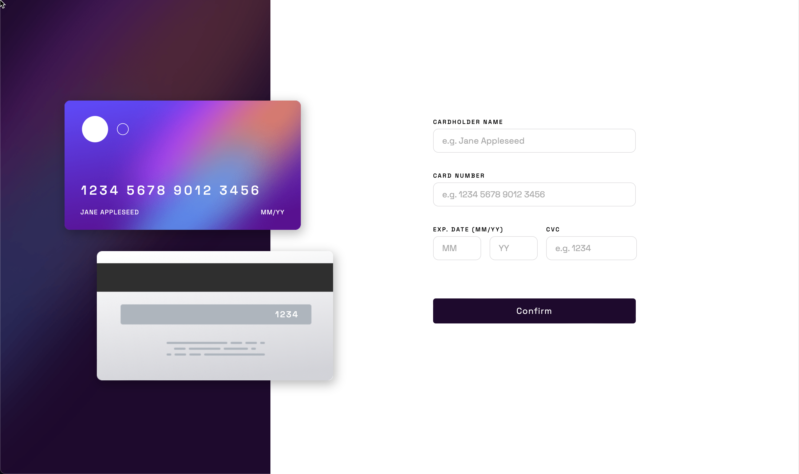

# Frontend Mentor - Interactive Card Details Form

This is a solution to the [Interactive card details form challenge on Frontend Mentor](https://www.frontendmentor.io/challenges/interactive-card-details-form-XpS8cKZDWw). Frontend Mentor challenges help you improve your coding skills by building realistic projects. 

## Table of contents

- [Overview](#overview)
  - [The challenge](#the-challenge)
  - [Screenshot](#screenshot)
  - [Links](#links)
- [My process](#my-process)
  - [Built with](#built-with)
  - [Useful resources](#useful-resources)
- [Author](#author)

## Overview

### Screenshot

### Links

- Solution URL: [Solution URL](https://www.frontendmentor.io/solutions/interactive-card-details-form-a53oDnEUtA)
- Live Site URL: [Live Site URL](https://marcosklender.github.io/Interactive-Card-Form/)

## My process

### Built with

- Semantic HTML5 markup
- CSS custom properties
- Flexbox
- CSS Grid
- Mobile-first workflow

### Useful resources

- [Google Fonts](https://fonts.google.com/knowledge)

## Author

- Website - [MarcosKlender](https://www.marcosklender.com)
- Frontend Mentor - [@MarcosKlender](https://www.frontendmentor.io/profile/MarcosKlender)
- Twitter - [@MarcosKlender](https://www.twitter.com/MarcosKlender)